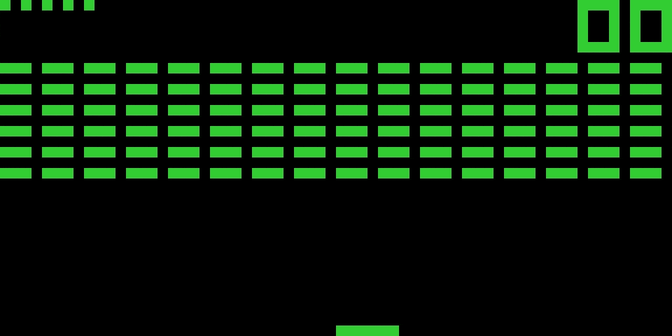

# Chip8-Emulator


## Usage
```bash
Usage: chip8-emulator [OPTIONS] <ROM_PATH>

Arguments:
  <ROM_PATH>  

Options:
  -c, --clock-speed <CLOCK_SPEED>  [default: 400]
  -h, --help                       Print help
```

## Configuration
Config file:
* ~/.config/chip8-emulator/config.toml
* C:\Users\%USERNAME%\AppData\Roaming\chip8-emulator\config.toml
* ~/Library/Application Support/chip8-emulator/config.toml

```toml
pixel_size = 15
on_color = [50, 205, 50]

[keys]
key_0 = "X"
key_1 = "Key1"
key_2 = "Key2"
key_3 = "Key3"
key_4 = "Q"
key_5 = "W"
key_6 = "E"
key_7 = "A"
key_8 = "S"
key_9 = "D"
key_a = "Y"
key_b = "C"
key_c = "Key4"
key_d = "R"
key_e = "F"
key_f = "V"
```